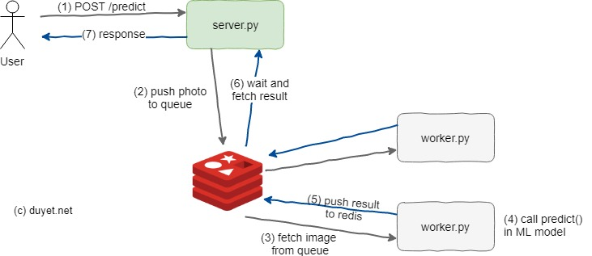
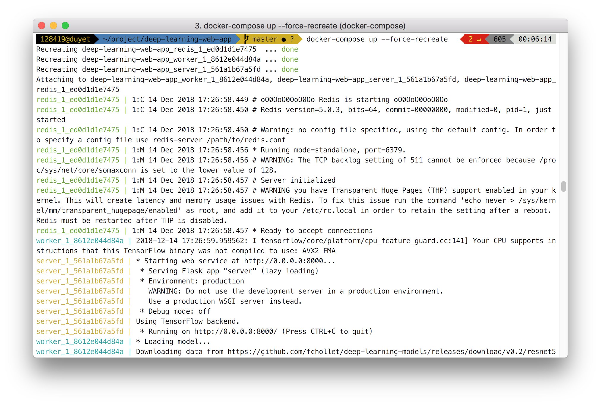
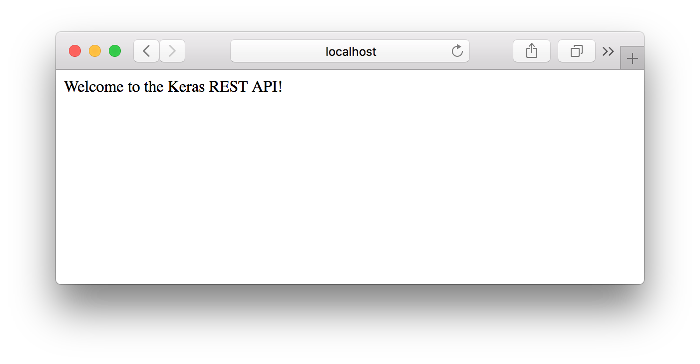
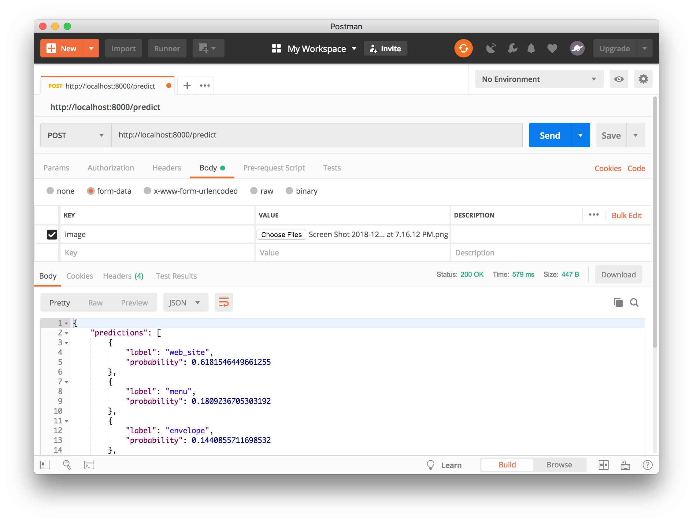

# A scalable Deep learning REST API

Deploy machine learning model as a web service API

Stack: 
- Keras: Machine learning
- Redis: an in-memory data structure store
- Flask: a micro web framework for Python

Workflow:



# Installation 

1. Install `redis-server` 

    ```
    sudo apt-get install -y redis redis-server
    ```

    Test the redis server:
    ```
    $ redis-cli ping
    PONG
    ```

2. Install python, pip, install packages by:

    ```
    virtualenv venv                   # create virtual environment folder
    source ./venv/bin/activate        # activate env
    pip install -r requirements.txt   # install packages
    ```

3. Run the worker model

    ```
    python worker.py
    ```

4. Open another terminal, start the web server

    ```
    python server.py
    ```

4. Using cURL to test the api /predict

    ```
    curl -X POST http://localhost:5000/predict \
         -F 'image=@file.png'
    ```

    It's will show you the output like this:
    ```
    {
        "predictions": [
            {
                "label": "web_site",
                "probability": 0.8858472108840942
            },
            {
                "label": "bow_tie",
                "probability": 0.06905359774827957
            },
            {
                "label": "laptop",
                "probability": 0.015353902243077755
            },
            {
                "label": "monitor",
                "probability": 0.005411265417933464
            },
            {
                "label": "notebook",
                "probability": 0.0035434039309620857
            }
        ],
        "success": true
    }
    ```

# Docker

```
docker-compose up
```



Visit: http://localhost:8000/predict


Test with Postman


